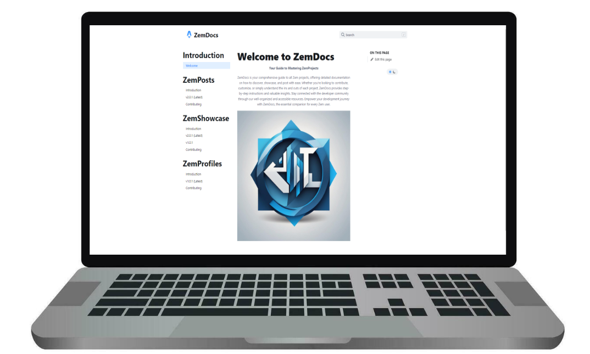

<p align = "center">


<br>

<br>


</p>

<h1 align = "center">
  ZemDocs
</h1>

<p align = "center">
  Your Guide to Mastering Zem Projects
</p>

<p align = "center">
  
</p>

## ❗ About:

ZemDocs is your comprehensive guide to all Zem projects, offering detailed documentation on how to discover, showcase, and post with ease. Whether you're looking to contribute, customize, or simply understand the ins and outs of each project, ZemDocs provides step-by-step instructions and valuable insights. Stay connected with the developer community through our well-organized and accessible resources. Empower your development journey with ZemDocs, the essential companion for every Zem user.

## ⭐ Features:

- [x] 👀 Dark & Light Theme
- [x] 🔎 Search Bar powered by Algolia
- [x] 📚 Automatically Generated Table of Contents
- [x] ✅ Markdown
- [x] 🫂 Self-Updating list of Collaborators

## 🏃‍♂️ Quick Start:

- This project can be locally executed on your machine in 4 simple steps!

> [!Tip]
> [NodeJS](https://nodejs.org/) needs to be installed on your machine. 


1. Make a `Copy` of this Repository on your machine by using the following `git command` in your terminal:

```
git clone https://github.com/Zemerik/ZemDocs.git
```

2. `Navigate` into the Project's `directory` by entering the following `command` in your terminal:

```
cd ZemDocs
```

3. `Install` the required `Dependencies` by using `NPM`:

```nodejs
npm i
```

4. Start the `Development Server` through the following `command`:

```nodejs
npm run dev
```

> You should now be able to see the outcome on `localhost:3000`

## 🤝 Contributing:

Contributions are always welcome and appreciated. Feel free to create an Issue or Pull - Request for any fixes, bug reports, feature request or anything else!

## 💁 Support:

For any kind of support or inforrmation, you are free to join our **Discord Server**,

<a href = "https://discord.gg/UF9KsmuGbr">
  
</a>

## 🥳 Contributors:

Thanks to all Contributors!


<h1 align = "center">
  Thanks for Visiting🙏
</h1>

<p align = "center">
  Don't forget to leave a ⭐
  <br>
  Made with 💖 by <a href = "https://github.com/Zemerik">Hemang Yadav (Zemerik)</a>
</p>
